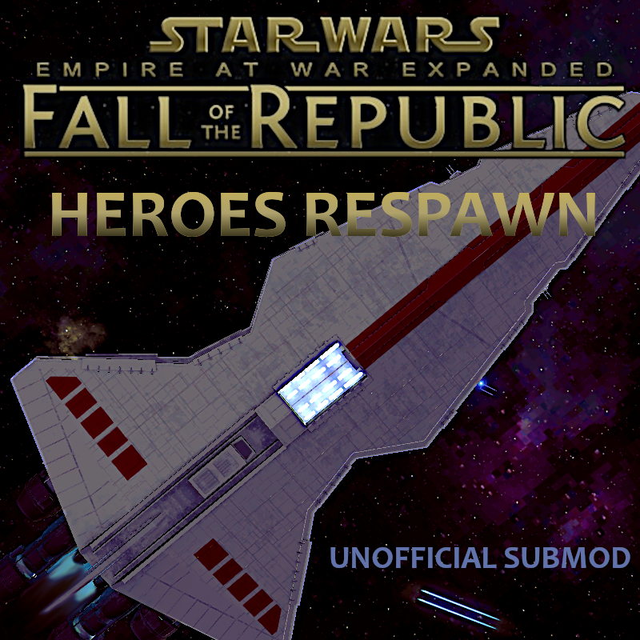

**Disclaimer**: This project is not affiliated with the EaWX team.

# FotR Heroes Respawn

For those who love heroes!

### About

- Most heroes respawn on a 10 cycle timer when "killed."
- This can be toggled on and off at any time through buttons in the advanced options tab (Human and AI can be toggled separately).
- All the default special respawns remain unchanged (Grievous, Trench, Durge, Dooku, etc.).

### Republic Recruitable Heroes

- When one of these heroes are defeated, their slot is effectively suspended until they respawn.
- Added option to increase slots for all hero categories by one, which can be used as many times as needed.
  Check the *advanced options tab.*

### Exceptions to Respawn

- **Mandator II:** Onara Kuat (Pride of the Core)
- **Tagge Battlecruiser:** Sanya Tagge, Orman Tagge
- **Lucrehulk:** Krett, Merai, Doctor, Tonith, Tuuk, and Pundar.
- **Devastation:** Sai Sircu
- **Subjugator:** Shu Mai
- Exceptions can be edited here: `Data\Scripts\Library\RespawnExceptions.lua`

### One Planet Start

- Heroes spawn at the beginning of FTGU single planet start games, matching the era selected.
- Enabled Republic command staff and clones disabled in era 1.

## How to Edit GameConstants

**To edit respawn time:**

1. Go to `Steam\steamapps\workshop\content\32470\2792708794\Data\XML`
2. Open `GameConstants.xml`
3. Find line (418): `<Default_Hero_Respawn_Time>400</Default_Hero_Respawn_Time>`

# License

All **original code** authored in this project is available under the [MIT License](LICENSE).

This repository depends on files derived from **EaWX mods**.
See [ASSETS.md](ASSETS.md) for details on third-party content and asset usage.

### Workshop Content

The `mod/` directory contains the files uploaded to the Steam Workshop.

# Credits

Thanks to the EaWX team for creating and maintaining the EaWX mods.
